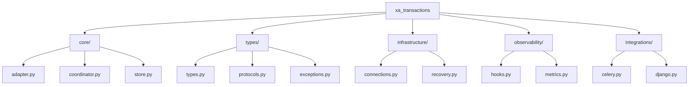
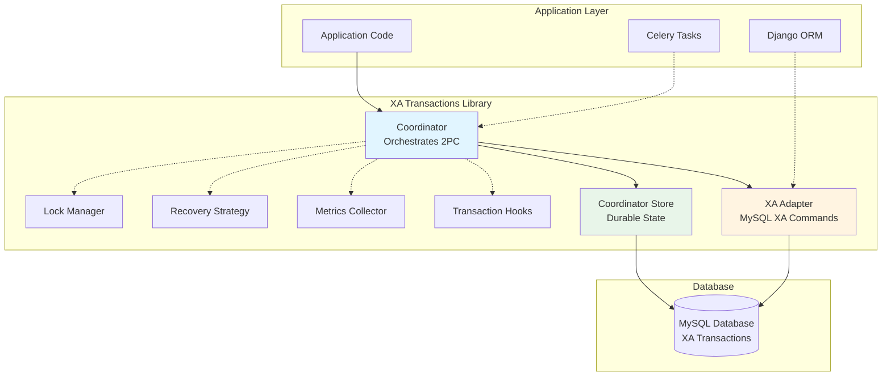
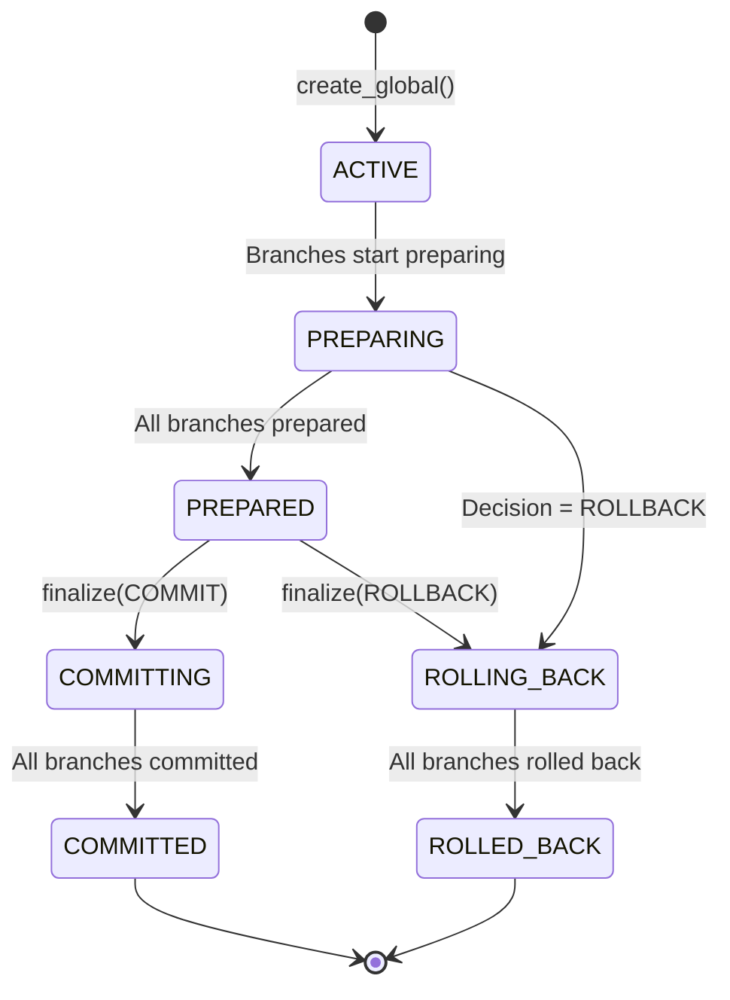
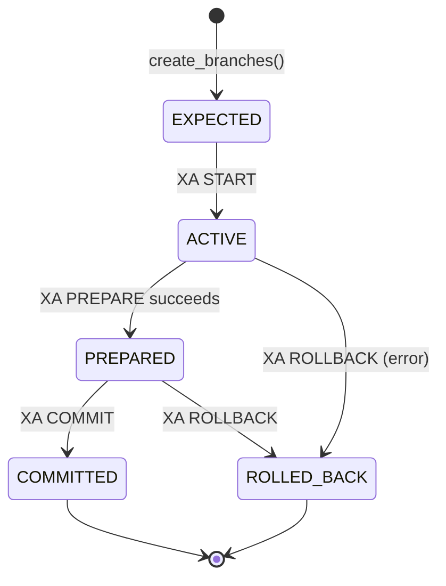
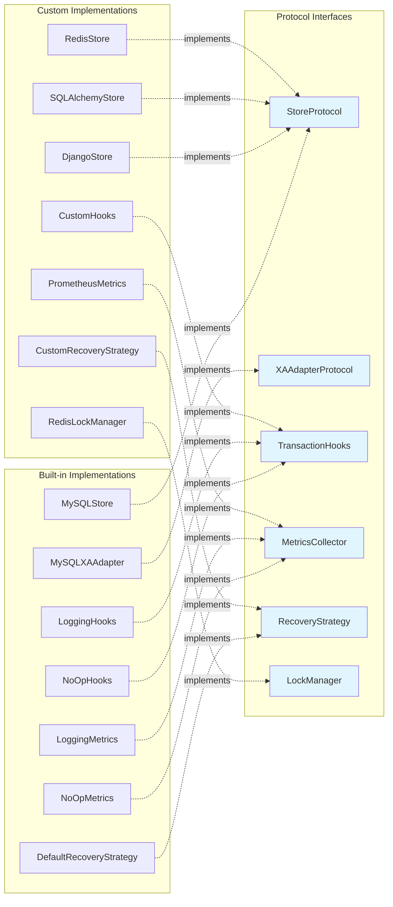

# Architecture

This document describes the architecture and design decisions for the XA Transactions library.

## Overview

The library provides a complete solution for coordinating MySQL XA (2-phase commit) transactions across parallel workers. It handles the complexity of XA protocol management, state tracking, recovery, and integration with distributed task systems like Celery.

## Module Organization

The library is organized into logical submodules:

- **`core/`**: Core business logic (adapter, coordinator, store)
- **`types/`**: Type definitions, protocols, and exceptions
- **`infrastructure/`**: Supporting infrastructure (connections, recovery)
- **`observability/`**: Monitoring and hooks (hooks, metrics)
- **`integrations/`**: External integrations (Celery, Django)



All public APIs are exported from the main `xa_transactions` package, so users can import directly:
```python
from xa_transactions import Coordinator, MySQLXAAdapter, MySQLStore
```

## Core Components

The library's architecture centers around three core components that work together to coordinate distributed transactions:



**Component Responsibilities:**
- **Coordinator**: Orchestrates the 2-phase commit protocol, manages state, handles recovery
- **XA Adapter**: Executes MySQL XA commands (START, END, PREPARE, COMMIT, ROLLBACK, RECOVER)
- **Coordinator Store**: Maintains durable state for global transactions and branches

### 1. XA Adapter (`xa_transactions.core.adapter`)

The `MySQLXAAdapter` class provides a driver-agnostic interface for executing MySQL XA commands. It abstracts away differences between MySQL drivers (mysql.connector, PyMySQL, mysqlclient, etc.) and provides a consistent API.

**Key Methods:**
- `xa_start(xid)`: Start an XA transaction
- `xa_end(xid)`: End (suspend) an XA transaction
- `xa_prepare(xid)`: Prepare a transaction for commit
- `xa_commit(xid)`: Commit a prepared transaction
- `xa_rollback(xid)`: Rollback a transaction
- `xa_recover()`: Recover prepared transactions
- `branch_transaction(gtrid, bqual)`: Context manager for branch transactions

**Design Decisions:**
- Uses Protocol-based typing to support any MySQL connection object
- Provides context manager for automatic XA lifecycle management
- Handles different data formats from XA RECOVER (bytes vs strings)

### 2. Coordinator Store (`xa_transactions.core.store`)

The `MySQLStore` manages durable state for transaction coordination. It uses MySQL tables to track global transactions and branches. The store implements the `StoreProtocol` interface, allowing for alternative implementations (e.g., Django, SQLAlchemy).

**Schema:**

```sql
CREATE TABLE xa_global (
    gtrid VARCHAR(255) PRIMARY KEY,
    decision VARCHAR(20) NOT NULL DEFAULT 'UNKNOWN',
    state VARCHAR(20) NOT NULL DEFAULT 'ACTIVE',
    expected_count INT NOT NULL,
    created_at DATETIME(6) NOT NULL,
    updated_at DATETIME(6) NOT NULL,
    finalized_at DATETIME(6) NULL
);

CREATE TABLE xa_branch (
    gtrid VARCHAR(255) NOT NULL,
    bqual VARCHAR(255) NOT NULL,
    state VARCHAR(20) NOT NULL DEFAULT 'EXPECTED',
    created_at DATETIME(6) NOT NULL,
    updated_at DATETIME(6) NOT NULL,
    prepared_at DATETIME(6) NULL,
    PRIMARY KEY (gtrid, bqual),
    FOREIGN KEY (gtrid) REFERENCES xa_global(gtrid) ON DELETE CASCADE
);
```

**Design Decisions:**
- Separate tables for global and branch state
- Foreign key constraint ensures referential integrity
- Timestamps for recovery and monitoring
- State machine tracking for both global and branch transactions

### 3. Coordinator (`xa_transactions.core.coordinator`)

The `Coordinator` class is the main API for managing XA transactions. It orchestrates the 2-phase commit protocol and handles recovery. It accepts pluggable components via protocols (store, adapter, hooks, metrics, recovery strategy, lock manager).

**Key Methods:**
- `create_global(expected_branches)`: Create a new global transaction
- `create_branches(gtrid, count)`: Create branch records
- `mark_branch_prepared(gtrid, bqual)`: Mark a branch as prepared
- `finalize(gtrid, decision)`: Commit or rollback a global transaction
- `gc(max_age_seconds)`: Garbage collect and recover in-doubt transactions
- `reconcile_branch(gtrid, bqual)`: Check if a branch is prepared via XA RECOVER

**State Machine:**

Global States:
- `ACTIVE`: Transaction created, branches executing
- `PREPARING`: Branches being prepared
- `PREPARED`: All branches prepared
- `COMMITTING`: Committing branches
- `COMMITTED`: All branches committed
- `ROLLING_BACK`: Rolling back branches
- `ROLLED_BACK`: All branches rolled back



Branch States:
- `EXPECTED`: Branch record created, not yet started
- `ACTIVE`: XA START issued, executing
- `PREPARED`: XA PREPARE succeeded
- `COMMITTED`: XA COMMIT succeeded
- `ROLLED_BACK`: XA ROLLBACK succeeded



**Design Decisions:**
- Idempotent finalization operations
- Restart-safe: can resume after coordinator restart
- Partial progress tolerance: handles some branches failing
- Automatic recovery via GC process

### 4. Celery Integration (`xa_transactions.integrations.celery`)

Optional helpers for integrating XA transactions with Celery tasks. This is an optional dependency - the core library works without Celery.

**Components:**
- `XATask`: Base class for Celery tasks with XA support
- `xa_task`: Decorator for automatic XA management
- `create_xa_chord`: Helper for creating Celery chords with XA coordination
- `get_xa_context_from_task`: Utility to get XA context from current task

**Design Decisions:**
- Optional dependency: Celery not required for core functionality
- Transparent integration: tasks can remain unaware of XA details
- Automatic XA lifecycle management via decorators/base classes

## Workflow

### Normal Flow

1. **Orchestration:**
   ```python
   gtrid = coordinator.create_global(expected_branches=3)
   bquals = coordinator.create_branches(gtrid, count=3)
   ```

2. **Parallel Workers:**
   ```python
   with adapter.branch_transaction(gtrid, bqual):
       adapter.execute("INSERT INTO ...")
       adapter.execute("UPDATE ...")
   coordinator.mark_branch_prepared(gtrid, bqual)
   ```

3. **Finalization:**
   ```python
   coordinator.finalize(gtrid, Decision.COMMIT)
   ```

### Recovery Flow

1. **Periodic GC:**
   ```python
   coordinator.gc(max_age_seconds=3600)
   ```

2. **GC Process:**
   - Query `XA RECOVER` to find prepared transactions
   - Reconcile with coordinator store
   - For transactions with decision=COMMIT: commit all prepared branches
   - For transactions with decision=ROLLBACK: rollback all prepared branches
   - For transactions with decision=UNKNOWN and expired: auto-rollback

3. **Branch Reconciliation:**
   ```python
   state = coordinator.reconcile_branch(gtrid, bqual)
   ```

## Failure Handling

### Before PREPARE

If a connection dies before `XA PREPARE`:
- The transaction is not recoverable via XA RECOVER
- Retry the branch from scratch
- No cleanup needed

### After PREPARE

If a connection dies after `XA PREPARE`:
- Transaction appears in `XA RECOVER`
- Recovery process will finalize it based on decision
- Branch state is updated in coordinator store

### Ambiguous PREPARE

If unsure whether PREPARE succeeded:
1. Reconnect to database
2. Query `XA RECOVER`
3. If XID present: branch is prepared, mark in store
4. If XID absent: retry branch from scratch

## Pluggable Architecture

The library uses Python Protocols to enable pluggable implementations:

- **`StoreProtocol`**: Implement custom stores (Django, SQLAlchemy, Redis, etc.)
- **`XAAdapterProtocol`**: Implement custom XA adapters (for different databases)
- **`TransactionHooks`**: Custom lifecycle event handlers
- **`MetricsCollector`**: Custom metrics collection
- **`RecoveryStrategy`**: Custom recovery logic
- **`LockManager`**: Distributed locking for multi-coordinator scenarios



See `examples/custom_store_example.py` for an example of implementing a custom store.

## Key Design Principles

1. **Idempotency**: All finalization operations are idempotent
2. **Restart Safety**: Coordinator can be restarted without losing state
3. **Partial Progress Tolerance**: Handles some branches failing
4. **Driver Agnostic**: Works with any MySQL Python driver
5. **Recovery First**: Built-in recovery mechanisms for all failure scenarios
6. **Pluggable Components**: Protocol-based architecture allows custom implementations

## Limitations

1. **MySQL Only**: Designed specifically for MySQL XA protocol (though `XAAdapterProtocol` allows for future multi-database support)
2. **Multi-Coordinator**: Requires distributed locking for safe multi-coordinator operation
3. **No Saga Pattern**: Uses strict 2PC, not eventual consistency
4. **Connection Management**: Does not manage connection pooling (user responsibility, though `ConnectionFactory` protocol is provided)

## Future Enhancements

Potential improvements:
- Additional store implementations (Django, SQLAlchemy)
- Additional XA adapter implementations (PostgreSQL, other databases)
- Transaction timeout management
- Multi-database support (different databases per branch)
- Saga pattern alternative implementation
- Additional metrics backends (Prometheus, StatsD, etc.)