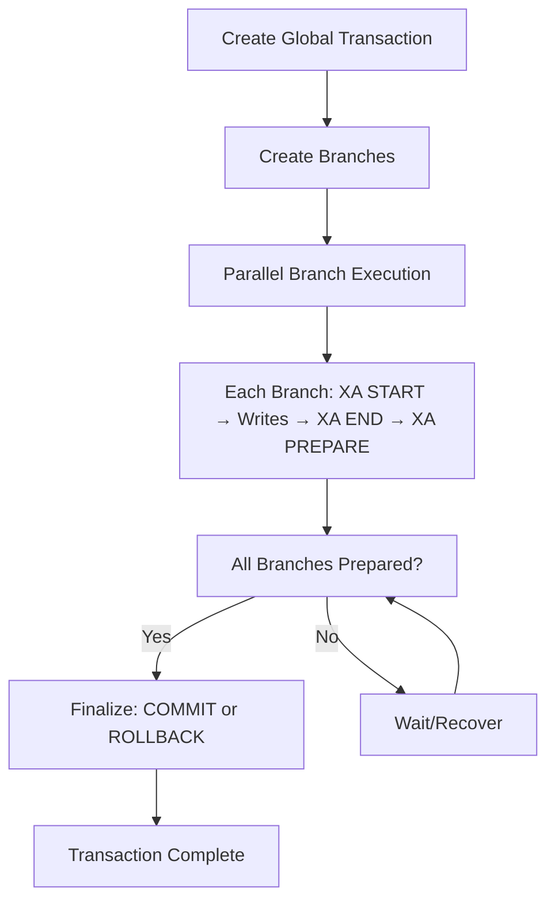

# XA Transactions

A Python library for coordinating MySQL XA (2-phase commit) transactions across parallel workers with strict all-or-nothing semantics.

## Overview

This library provides a complete solution for managing distributed MySQL transactions using the XA protocol. It's designed for scenarios where:

- You need parallel writers (e.g., Celery tasks)
- Foreign key constraints must be respected
- Strict atomic commit/rollback is required
- A single-writer transaction is not feasible

## How It Works

The library coordinates a 2-phase commit protocol across parallel workers:



**Key Steps:**
1. **Create**: Coordinator creates a global transaction and branch records
2. **Execute**: Parallel workers each run `XA START`, perform writes, then `XA PREPARE`
3. **Finalize**: Once all branches are prepared, coordinator commits or rolls back atomically
4. **Recovery**: Automatic garbage collection recovers in-doubt transactions

## Features

- **XA Protocol Support**: Full implementation of MySQL XA commands (START, END, PREPARE, COMMIT, ROLLBACK, RECOVER)
- **Pluggable Store Backends**: Protocol-based architecture allows Django, SQLAlchemy, or custom implementations
- **Coordinator Store**: Durable state tracking for global transactions and branches
- **Recovery & GC**: Automatic recovery of in-doubt transactions and garbage collection
- **Celery Integration**: Optional helpers for seamless Celery task integration
- **Idempotent Operations**: All finalization operations are idempotent and restart-safe

## Installation

Requires **Python 3.10+**.

```bash
pip install xa-transactions
```

For Celery integration:

```bash
pip install xa-transactions[celery]
```

## Development

Use a **virtual environment** and **pip** (do not install into the system interpreter).

From the repository root:

```bash
python3 -m venv .venv
source .venv/bin/activate   # Linux / macOS
# .venv\Scripts\activate    # Windows (cmd/PowerShell)
python -m pip install -U pip
python -m pip install -e ".[dev]"
```

That installs the package in editable mode plus dev tools (Ruff, pytest, pre-commit). Optional extras: `pip install -e ".[dev,celery]"` if you need Celery locally.

**Git hooks (recommended):** after installing dev deps, run `pre-commit install` once. Commits then run **Ruff** on `xa_transactions/` and `tests/` (same scope as CI) and **unit tests only** via [`scripts/pre_commit_pytest_unit.sh`](scripts/pre_commit_pytest_unit.sh) (prefers `.venv/bin/python` when present; same `-m "not celery and not django"` as default `pytest`). Integration tests with `@pytest.mark.celery` / `django` are not run. Run everything manually with `pre-commit run --all-files`.

Building **`mysqlclient`** may require MySQL/MariaDB client libraries and build tools on your OS; if install fails, use **`PyMySQL`** (already a dependency) or install the client headers first.

Optional helpers (same end state as the commands above):

```bash
./scripts/check_dev_dependencies.sh           # macOS only: summarize missing deps, then [y/n/a] per install (a = yes to rest); full report after
./scripts/check_dev_dependencies.sh --dry-run # only missing deps, one line each (missing:… / optional:…)
./scripts/check_dev_dependencies.sh -y        # non-interactive: brew + pyenv (does not change default python3 / pyenv global)
./scripts/setup_local_env.sh        # create .venv and pip install -e ".[dev]"
```

### Testing

**PR / default local run:** **Ruff** + **unit tests** (excludes optional integration tests):

```bash
ruff check xa_transactions tests && ruff format --check xa_transactions tests
pytest --cov=xa_transactions --cov-report=term-missing
```

Do not reduce coverage without a good reason (review in PRs).

**Optional integrations** (Celery / Django) are behind pytest markers. Install extras, then run only those tests:

```bash
pip install -e ".[dev,celery,django]"
pytest -m "celery or django" -v
```

CI runs **Linux × Python 3.10–3.12**: unit job (ruff + default `pytest`), plus a separate job for marked integration tests with extras. Releases should go out only when CI is green on the tagged commit.

## Quick Start

```python
from xa_transactions import Coordinator, XAAdapter, MySQLStore
import mysql.connector

# Create XA adapter
adapter = XAAdapter(mysql.connector.connect(...))

# Create store (MySQL implementation)
store = MySQLStore(mysql.connector.connect(...))

# Create coordinator with store
coordinator = Coordinator(adapter, store)

# Create global transaction
gtrid = coordinator.create_global(expected_branches=3)

# Create branches
bquals = coordinator.create_branches(gtrid, count=3)

# In parallel workers:
for bqual in bquals:
    with adapter.branch_transaction(gtrid, bqual):
        # Perform your writes
        adapter.execute("INSERT INTO ...")
        adapter.execute("UPDATE ...")

# Finalize (commit or rollback)
coordinator.finalize(gtrid, decision="COMMIT")
```

## Pluggable Store Implementations

The library uses Protocol-based interfaces, allowing you to use any store backend:

```python
from xa_transactions import Coordinator, XAAdapter, StoreProtocol
from xa_transactions.store import MySQLStore

# Use built-in MySQL store
store = MySQLStore(mysql_connection)
coordinator = Coordinator(adapter, store)

# Or implement your own (Django, SQLAlchemy, Redis, etc.)
class DjangoStore:
    def ensure_schema(self): ...
    def create_global(self, ...): ...
    def get_global(self, ...): ...
    # ... implement all StoreProtocol methods

store = DjangoStore()
coordinator = Coordinator(adapter, store)  # Works seamlessly!
```

See [examples/custom_store_example.py](examples/custom_store_example.py) for a complete example.

## Documentation

- **[Architecture Guide](ARCHITECTURE.md)**: Detailed design documentation
- **[Django Integration Guide](docs/DJANGO.md)**: Using XA transactions with Django ORM
- **[Celery Integration Guide](docs/CELERY.md)**: Coordinating XA transactions across parallel Celery tasks

## Architecture

See [ARCHITECTURE.md](ARCHITECTURE.md) for detailed design documentation.

## License

MIT
