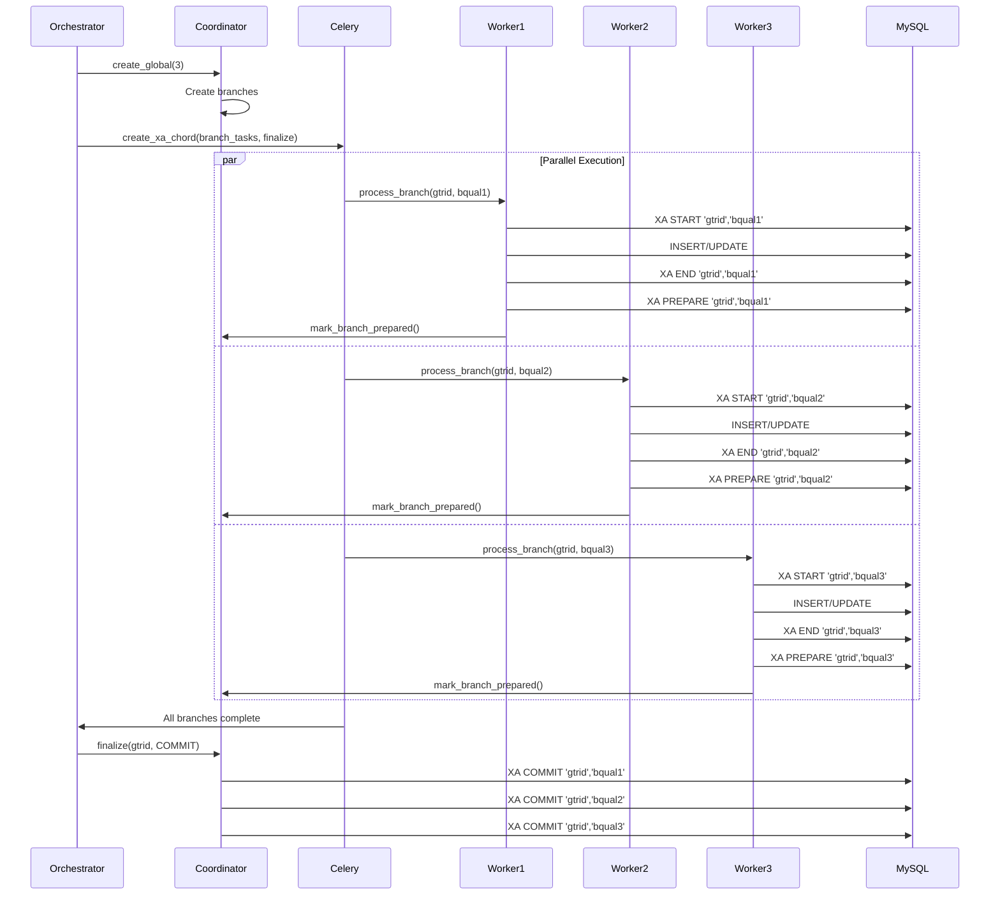
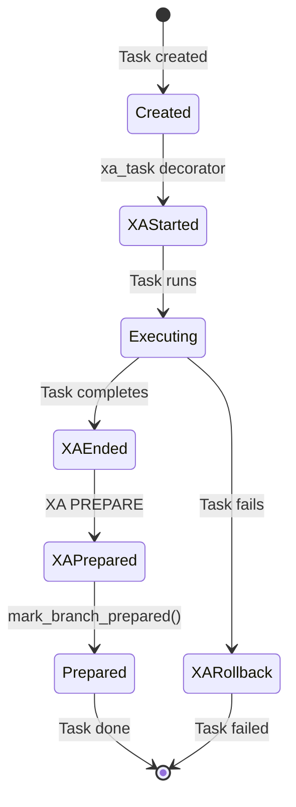
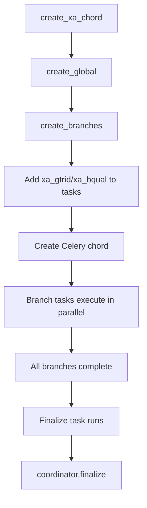
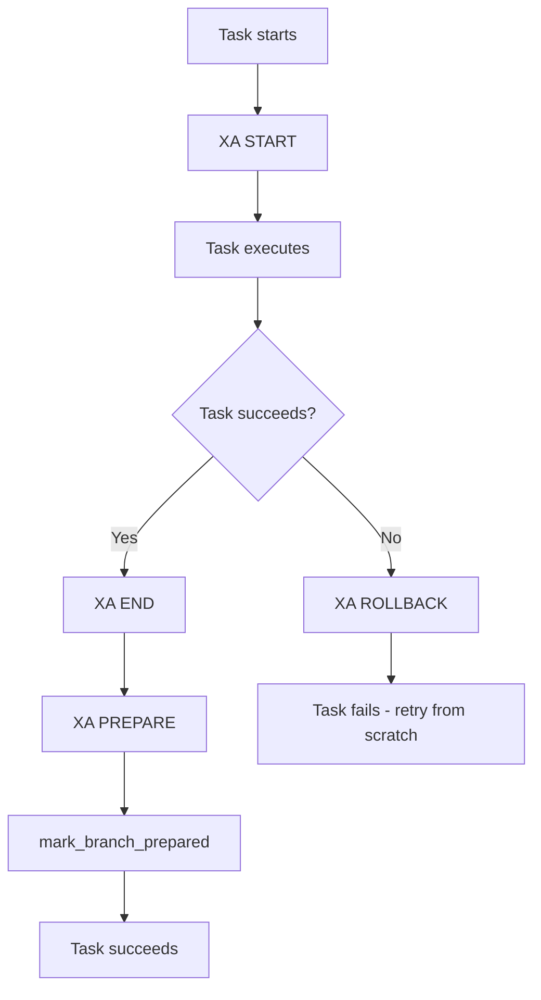
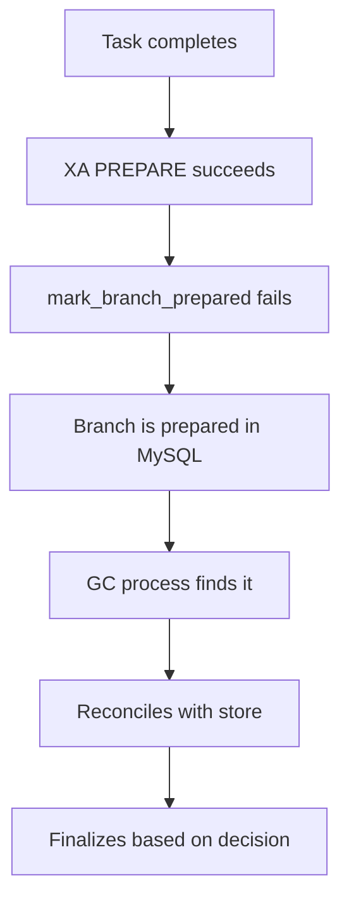

# Celery Integration Guide

This guide explains how to use XA transactions with Celery for parallel distributed transaction coordination.

## Overview

The Celery integration provides:
- **Automatic XA Management**: Decorators and base classes handle XA lifecycle
- **Chord Pattern Support**: Built-in helpers for coordinating parallel tasks
- **Transparent Integration**: Tasks remain unaware of XA details
- **Django Compatibility**: Works seamlessly with Django ORM in Celery tasks

## Installation

```bash
pip install xa-transactions[celery]
```

Or install Celery separately:
```bash
pip install xa-transactions celery
```

## Quick Start

### 1. Basic Setup

```python
from celery import Celery
from xa_transactions import (
    MySQLXAAdapter,
    Coordinator,
    MySQLStore,
    Decision,
    xa_task,
    create_xa_chord,
)

app = Celery("myapp")

# Connection factory
def get_adapter():
    return MySQLXAAdapter(get_connection())

# Coordinator (shared instance)
coordinator = Coordinator(get_adapter(), MySQLStore(get_store_connection()))

# Task with XA support
@app.task
@xa_task(get_adapter)
def process_branch(xa_gtrid, xa_bqual, data):
    """Process a branch - XA START/END/PREPARE handled automatically."""
    adapter = get_adapter()
    adapter.execute("INSERT INTO ...", (data["id"], data["value"]))
    coordinator.mark_branch_prepared(xa_gtrid, xa_bqual)

# Finalize task
@app.task
def finalize(xa_gtrid, decision):
    coordinator.finalize(xa_gtrid, Decision[decision])

# Create and run chord
branch_tasks = [process_branch.s(gtrid, data=d) for d in data_list]
gtrid, result = create_xa_chord(
    coordinator=coordinator,
    branch_tasks=branch_tasks,
    finalize_task=finalize.s(gtrid, decision="COMMIT"),
)
```

## Architecture

### Parallel Execution Flow



### Task Lifecycle



## Integration Methods

### Method 1: Decorator (`@xa_task`)

Simplest approach - decorator handles everything:

```python
@app.task
@xa_task(get_adapter)
def process_branch(xa_gtrid, xa_bqual, data):
    """XA START/END/PREPARE handled by decorator."""
    adapter = get_adapter()
    adapter.execute("INSERT INTO ...", (data["id"], data["value"]))
    coordinator.mark_branch_prepared(xa_gtrid, xa_bqual)
```

**How it works:**
1. Decorator extracts `xa_gtrid` and `xa_bqual` from kwargs
2. Calls `XA START` before task execution
3. Executes task
4. Calls `XA END` and `XA PREPARE` after success
5. Calls `XA ROLLBACK` on failure

### Method 2: Base Class (`XATask`)

More control - inherit from `XATask`:

```python
from xa_transactions import XATask

class MyXATask(XATask):
    def run(self, data):
        """Task logic here."""
        adapter = self.get_xa_context()["adapter"]
        adapter.execute("INSERT INTO ...", (data["id"], data["value"]))
        coordinator.mark_branch_prepared(
            self._xa_gtrid,
            self._xa_bqual
        )

# Set context before calling
task = MyXATask()
task.set_xa_context(adapter, gtrid, bqual)
result = task.apply(args=[data])
```

### Method 3: Manual XA Management

Full control - manage XA yourself:

```python
@app.task
def process_branch(gtrid, bqual, data):
    adapter = get_adapter()
    xid = XID(gtrid=gtrid, bqual=bqual)
    
    try:
        adapter.xa_start(xid)
        adapter.execute("INSERT INTO ...", (data["id"], data["value"]))
        adapter.xa_end(xid)
        adapter.xa_prepare(xid)
        coordinator.mark_branch_prepared(gtrid, bqual)
    except Exception:
        adapter.xa_rollback(xid)
        raise
```

## Chord Pattern

The `create_xa_chord` helper simplifies creating Celery chords with XA coordination:



**Example:**
```python
# Create branch tasks
branch_tasks = [
    process_branch.s(data={"id": i, "value": f"value_{i}"})
    for i in range(10)
]

# Create finalize task
finalize = finalize_transaction.s(decision="COMMIT")

# Create chord with XA coordination
gtrid, result = create_xa_chord(
    coordinator=coordinator,
    branch_tasks=branch_tasks,
    finalize_task=finalize,
    expected_branches=10,  # Optional, defaults to len(branch_tasks)
)
```

## Django + Celery Integration

When using Django with Celery, the integration automatically tracks XA state:

```python
# In your Celery task
@app.task
@xa_task(get_django_adapter)
def process_branch_with_django(xa_gtrid, xa_bqual, data):
    """Use Django ORM in Celery task."""
    from myapp.models import Order, Payment
    
    # XA transaction is active (tracked automatically)
    Order.objects.create(user_id=data["user_id"], total=data["total"])
    Payment.objects.filter(order_id=data["order_id"]).update(status="processed")
    
    coordinator.mark_branch_prepared(xa_gtrid, xa_bqual)
```

**Django Connection Setup:**
```python
from django.db import connection

def get_django_adapter():
    return MySQLXAAdapter(connection.connection)

def get_django_store():
    return MySQLStore(connection.connection)
```

## Error Handling

### Task Failure Before PREPARE



**Behavior:**
- XA transaction is rolled back
- Task can be retried (no cleanup needed)
- No recovery required

### Task Failure After PREPARE



**Behavior:**
- Branch is prepared in MySQL (visible via `XA RECOVER`)
- Recovery process will find and finalize it
- Use `coordinator.gc()` for periodic recovery

### Recovery Strategy

```python
# Periodic recovery task
@app.task
def recover_xa_transactions():
    """Recover in-doubt XA transactions."""
    coordinator.gc(max_age_seconds=3600, auto_rollback_expired=True)
```

## Common Patterns

### Pattern 1: Simple Parallel Processing

```python
@app.task
@xa_task(get_adapter)
def process_item(xa_gtrid, xa_bqual, item_id):
    adapter = get_adapter()
    adapter.execute("UPDATE items SET status='processed' WHERE id=%s", (item_id,))
    coordinator.mark_branch_prepared(xa_gtrid, xa_bqual)

# Process items in parallel
items = [1, 2, 3, 4, 5]
branch_tasks = [process_item.s(item_id=i) for i in items]

gtrid, result = create_xa_chord(
    coordinator=coordinator,
    branch_tasks=branch_tasks,
    finalize_task=finalize.s(gtrid, "COMMIT"),
)
```

### Pattern 2: Batch Processing with Finalization

```python
@app.task
@xa_task(get_adapter)
def process_batch(xa_gtrid, xa_bqual, batch_data):
    adapter = get_adapter()
    for item in batch_data:
        adapter.execute("INSERT INTO ...", (item["id"], item["value"]))
    coordinator.mark_branch_prepared(xa_gtrid, xa_bqual)

@app.task
def finalize_batch(xa_gtrid, decision):
    coordinator.finalize(xa_gtrid, Decision[decision])
    # Additional cleanup/logging

# Process 10 batches in parallel
batches = [get_batch(i) for i in range(10)]
branch_tasks = [process_batch.s(batch_data=batch) for batch in batches]

gtrid, result = create_xa_chord(
    coordinator=coordinator,
    branch_tasks=branch_tasks,
    finalize_task=finalize_batch.s(gtrid, "COMMIT"),
)
```

### Pattern 3: Django ORM in Celery Tasks

```python
from django.db import connection
from xa_transactions import MySQLXAAdapter, Coordinator, MySQLStore

def get_django_adapter():
    return MySQLXAAdapter(connection.connection)

coordinator = Coordinator(
    get_django_adapter(),
    MySQLStore(connection.connection)
)

@app.task
@xa_task(get_django_adapter)
def process_order(xa_gtrid, xa_bqual, order_data):
    from myapp.models import Order, Inventory
    
    # Django ORM works seamlessly
    Order.objects.create(**order_data)
    Inventory.objects.filter(product_id=order_data["product_id"]).update(
        quantity=F('quantity') - order_data["quantity"]
    )
    
    coordinator.mark_branch_prepared(xa_gtrid, xa_bqual)
```

## Best Practices

1. **Shared Coordinator**: Use a single coordinator instance (shared across workers)
2. **Connection Management**: Create adapter per task (connections are per-task)
3. **Error Handling**: Always mark branches as prepared after successful PREPARE
4. **Recovery**: Run periodic `coordinator.gc()` to recover in-doubt transactions
5. **Idempotency**: Finalize operations are idempotent - safe to retry
6. **Monitoring**: Use hooks and metrics to monitor transaction health

## Troubleshooting

### Issue: Tasks complete but transaction not finalized

**Symptom:** Branches are prepared but transaction never commits

**Solution:** Ensure finalize task is called:
```python
# ✅ Correct - finalize task in chord
create_xa_chord(..., finalize_task=finalize.s(...))

# ❌ Wrong - no finalize task
chord(branch_tasks)()  # Missing finalize!
```

### Issue: Branch not found in recovery

**Symptom:** `XA RECOVER` shows prepared transaction but store doesn't have branch

**Solution:** Use `reconcile_branch()` or run `gc()`:
```python
# Reconcile specific branch
coordinator.reconcile_branch(gtrid, bqual)

# Or run GC to reconcile all
coordinator.gc()
```

### Issue: Connection errors in Celery tasks

**Symptom:** "MySQL server has gone away" errors

**Solution:** Create fresh connections per task:
```python
# ✅ Correct - new connection per task
def get_adapter():
    return MySQLXAAdapter(get_connection())

# ❌ Wrong - shared connection
adapter = MySQLXAAdapter(get_connection())  # Shared across tasks
```

## See Also

- [Celery Usage Example](../examples/celery_usage.py)
- [Django Integration Guide](./DJANGO.md)
- [Architecture Documentation](../ARCHITECTURE.md)
