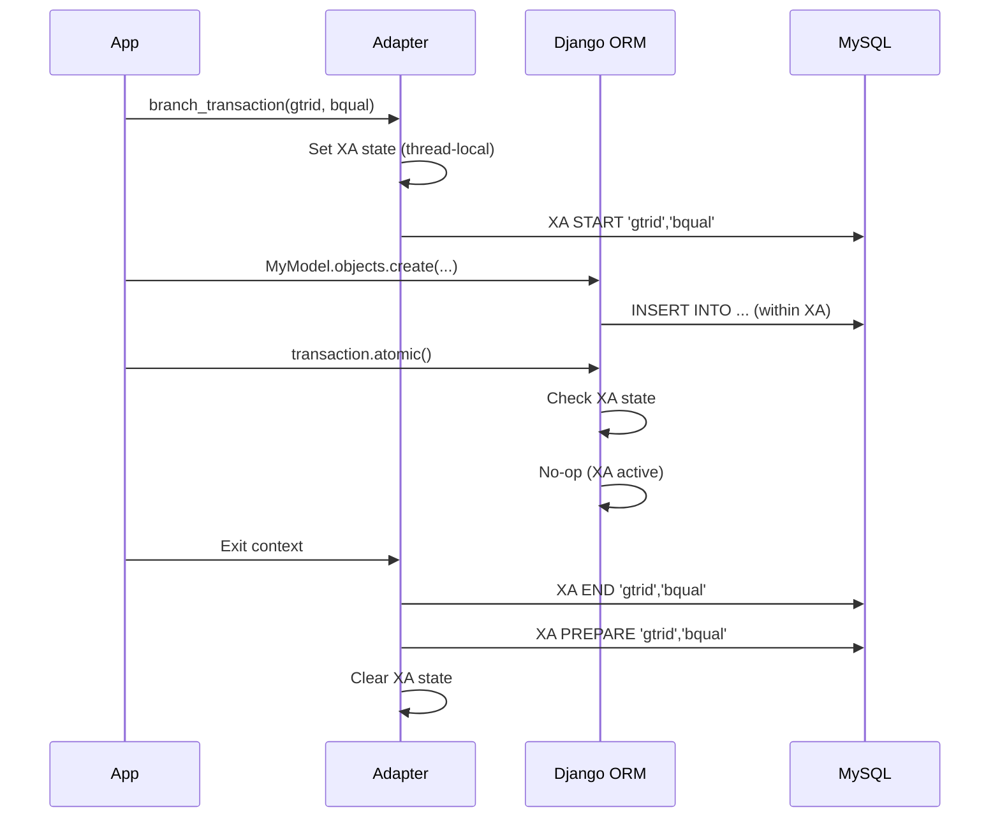
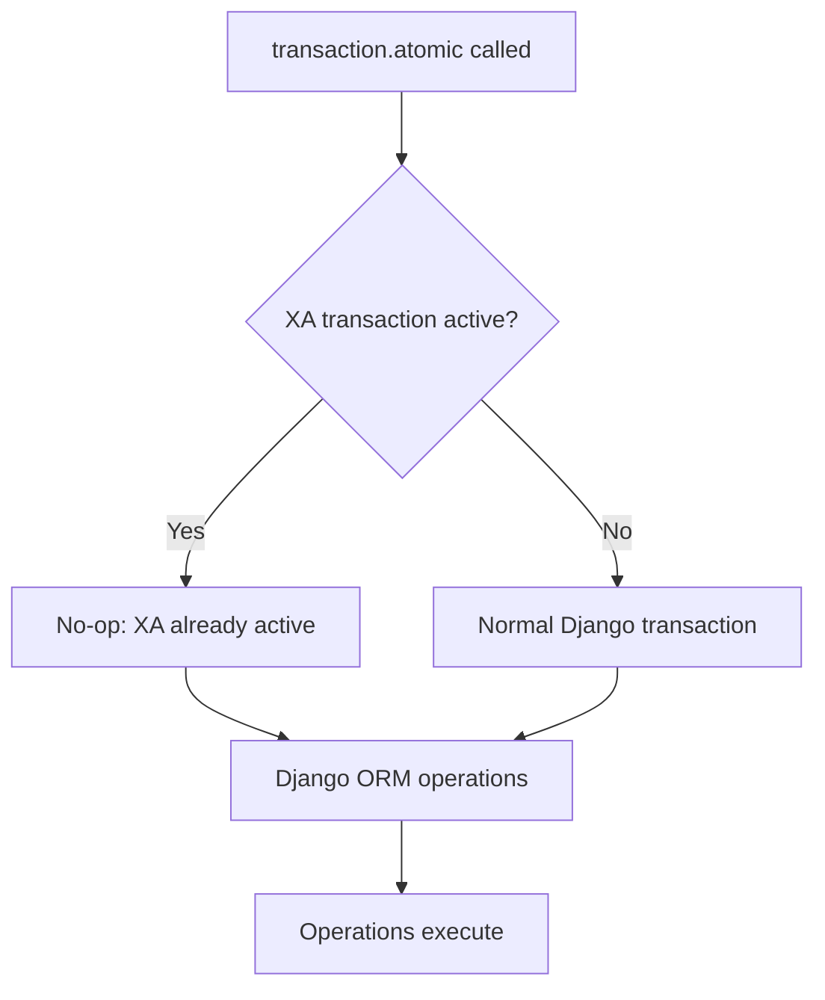
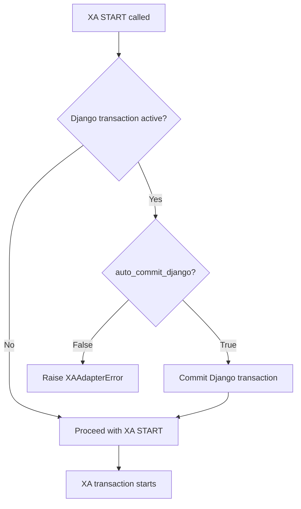
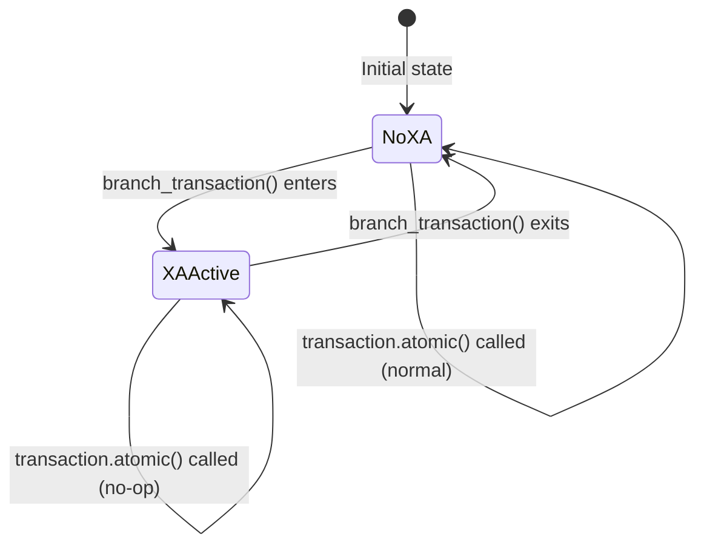

# Django Integration Guide

This guide explains how to use XA transactions with Django ORM, including seamless integration with Django's `transaction.atomic()`.

## Overview

The Django integration provides:
- **Seamless ORM Support**: Use Django ORM models inside XA transactions
- **Bidirectional Protection**: Automatic detection and handling of transaction conflicts
- **Optional Integration**: Enable XA-aware `transaction.atomic()` for transparent compatibility

## Installation

```bash
pip install xa-transactions
```

Django integration is included by default (no extra dependencies required).

## Quick Start

### 1. Enable XA-Aware Transactions (Optional but Recommended)

Choose one of three methods:

**Method 1: Explicit Call (Recommended)**
```python
# In settings.py or your app's ready() method
from xa_transactions.integrations.django import enable_xa_aware_transactions

enable_xa_aware_transactions()
```

**Method 2: Django Settings**
```python
# In settings.py
XA_TRANSACTIONS_ENABLE_DJANGO_INTEGRATION = True
```

**Method 3: Environment Variable**
```bash
export XA_ENABLE_DJANGO_INTEGRATION=1
```

### 2. Basic Usage

```python
from django.db import connection
from xa_transactions import MySQLXAAdapter, Coordinator, MySQLStore, Decision
from myapp.models import Order, Payment

# Create adapter using Django's connection
adapter = MySQLXAAdapter(connection.connection)
store = MySQLStore(connection.connection)
coordinator = Coordinator(adapter, store)

# Create global transaction
gtrid = coordinator.create_global(expected_branches=2)

# Create branches
bquals = coordinator.create_branches(gtrid, count=2)

# Process branches with Django ORM
for bqual in bquals:
    with adapter.branch_transaction(gtrid, bqual):
        # Django ORM works seamlessly!
        Order.objects.create(user_id=1, total=100.00)
        Payment.objects.filter(order_id=1).update(status='processed')
    
    coordinator.mark_branch_prepared(gtrid, bqual)

# Finalize
coordinator.finalize(gtrid, Decision.COMMIT)
```

## How It Works

### Transaction Flow



### Bidirectional Protection

The integration provides protection in both directions:

#### 1. XA Active → `transaction.atomic()` Called

When an XA transaction is active and code calls `transaction.atomic()`:



**Behavior:**
- If XA-aware transactions are enabled: `transaction.atomic()` becomes a no-op
- Django ORM operations execute within the XA transaction
- No conflicts or errors

**Example:**
```python
with adapter.branch_transaction(gtrid, bqual):
    # XA transaction is active
    MyModel.objects.create(...)
    
    # This works seamlessly if XA-aware transactions are enabled
    from django.db import transaction
    with transaction.atomic():
        OtherModel.objects.update(...)  # No error!
```

#### 2. Django Transaction Active → XA START Called

When a Django transaction is active and code tries to start an XA transaction:



**Behavior:**
- By default: Raises `XAAdapterError` (safe, prevents conflicts)
- With `auto_commit_django=True`: Auto-commits Django transaction first

**Example:**
```python
from django.db import transaction

# This will raise an error by default
with transaction.atomic():
    # Django transaction active
    with adapter.branch_transaction(gtrid, bqual):  # ❌ Error!
        pass

# Or allow auto-commit
with transaction.atomic():
    with adapter.branch_transaction(gtrid, bqual, auto_commit_django=True):  # ✅ Works
        pass
```

## State Tracking

The integration uses thread-local storage to track XA transaction state:



**Key Points:**
- State is tracked per-thread (safe for multi-threaded Django)
- Automatically set/cleared by `branch_transaction()` context manager
- Works with Celery tasks (each task runs in its own context)

## Common Patterns

### Pattern 1: Django View with XA Transactions

```python
from django.views import View
from django.http import JsonResponse
from django.db import connection
from xa_transactions import MySQLXAAdapter, Coordinator, MySQLStore, Decision

class ProcessOrderView(View):
    def post(self, request):
        adapter = MySQLXAAdapter(connection.connection)
        store = MySQLStore(connection.connection)
        coordinator = Coordinator(adapter, store)
        
        gtrid = coordinator.create_global(expected_branches=2)
        bquals = coordinator.create_branches(gtrid, count=2)
        
        try:
            for bqual in bquals:
                with adapter.branch_transaction(gtrid, bqual):
                    # Use Django ORM
                    Order.objects.create(...)
                    Inventory.objects.update(...)
                
                coordinator.mark_branch_prepared(gtrid, bqual)
            
            coordinator.finalize(gtrid, Decision.COMMIT)
            return JsonResponse({"status": "success"})
        except Exception:
            coordinator.finalize(gtrid, Decision.ROLLBACK)
            raise
```

### Pattern 2: Django Management Command

```python
from django.core.management.base import BaseCommand
from django.db import connection
from xa_transactions import MySQLXAAdapter, Coordinator, MySQLStore, Decision

class Command(BaseCommand):
    def handle(self, *args, **options):
        adapter = MySQLXAAdapter(connection.connection)
        store = MySQLStore(connection.connection)
        coordinator = Coordinator(adapter, store)
        
        # Process batches with XA transactions
        gtrid = coordinator.create_global(expected_branches=100)
        bquals = coordinator.create_branches(gtrid, count=100)
        
        for bqual in bquals:
            with adapter.branch_transaction(gtrid, bqual):
                # Bulk operations with Django ORM
                MyModel.objects.bulk_create([...])
            
            coordinator.mark_branch_prepared(gtrid, bqual)
        
        coordinator.finalize(gtrid, Decision.COMMIT)
```

### Pattern 3: Using `transaction.atomic()` Inside XA

```python
# Enable XA-aware transactions first
from xa_transactions.integrations.django import enable_xa_aware_transactions
enable_xa_aware_transactions()

# Now this works:
with adapter.branch_transaction(gtrid, bqual):
    from django.db import transaction
    
    # This becomes a no-op (XA already active)
    with transaction.atomic():
        MyModel.objects.create(...)
        OtherModel.objects.update(...)
```

## Configuration Options

### Enabling XA-Aware Transactions

**Explicit (Recommended):**
```python
from xa_transactions.integrations.django import enable_xa_aware_transactions
enable_xa_aware_transactions()
```

**Django Settings:**
```python
# settings.py
XA_TRANSACTIONS_ENABLE_DJANGO_INTEGRATION = True
```

**Environment Variable:**
```bash
export XA_ENABLE_DJANGO_INTEGRATION=1
```

### Disabling (for Testing/Debugging)

```python
from xa_transactions.integrations.django import disable_xa_aware_transactions
disable_xa_aware_transactions()
```

### Checking Status

```python
from xa_transactions.integrations.django import is_xa_aware_enabled

if is_xa_aware_enabled():
    print("XA-aware transactions are enabled")
```

## Troubleshooting

### Issue: `transaction.atomic()` conflicts with XA

**Symptom:** Error when calling `transaction.atomic()` inside XA transaction

**Solution:** Enable XA-aware transactions:
```python
from xa_transactions.integrations.django import enable_xa_aware_transactions
enable_xa_aware_transactions()
```

### Issue: Cannot start XA transaction while Django transaction active

**Symptom:** `XAAdapterError: Cannot start XA transaction while Django transaction is active`

**Solution:** Either:
1. Exit the Django transaction first
2. Use `auto_commit_django=True`:
   ```python
   with adapter.branch_transaction(gtrid, bqual, auto_commit_django=True):
       ...
   ```

### Issue: Django ORM operations not visible in XA transaction

**Symptom:** Changes made with Django ORM don't appear in XA transaction

**Solution:** Ensure you're using the same connection:
```python
# ✅ Correct
adapter = MySQLXAAdapter(connection.connection)

# ❌ Wrong (different connection)
adapter = MySQLXAAdapter(mysql.connector.connect(...))
```

## Best Practices

1. **Always use Django's connection**: `MySQLXAAdapter(connection.connection)`
2. **Enable XA-aware transactions**: For seamless `transaction.atomic()` compatibility
3. **Keep XA as outer transaction**: XA transactions should wrap Django transactions, not vice versa
4. **Handle errors properly**: Always finalize with COMMIT or ROLLBACK
5. **Use context managers**: `branch_transaction()` handles state automatically

## See Also

- [Basic Usage Example](../examples/basic_usage.py)
- [Django Usage Example](../examples/django_usage.py)
- [Architecture Documentation](../ARCHITECTURE.md)
